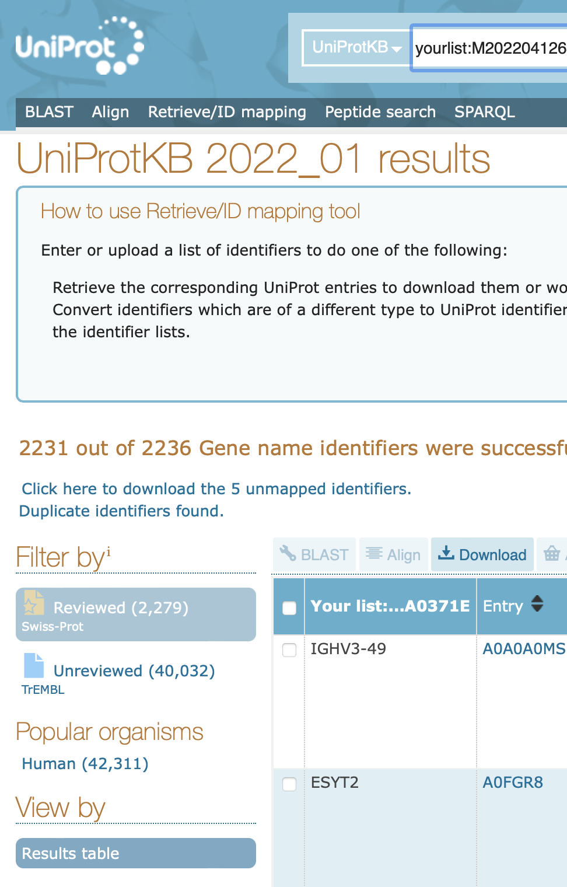
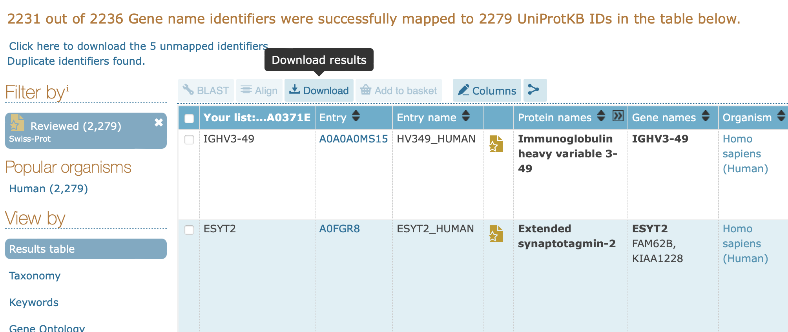
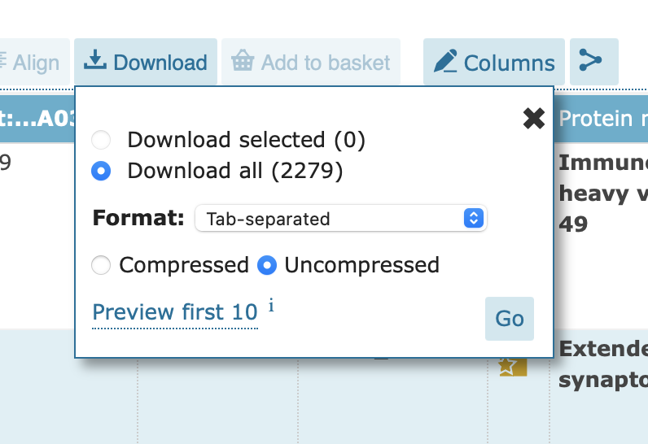

# VolcanoPlot
Making volcano plots from proteomic data in IgorPro

- [Using data direct from MaxQuant](#from-maxquant)
- [Doing manual analysis](#manual-analysis)
- [Volcano Plot outputs](#outputs)
- [Subcellular analysis](#subcellular-analysis)
- [Further notes](#further-notes)

## From MaxQuant

You can load data from a `proteinGroups.txt` file using the *Load MaxQuant Data...* option. This will load the data and do the analysis.
This procedure will do a comparison of "LFQ Intensity" from proteomics data using two conditions.

Tell Igor which two conditions you want to compare (give Igor a wildcard searchstring to specify waves), e.g. `ctrl*` and `test*` will find ctrl_1,ctrl_2 etc. and test_1,test_2 etc.

Also tell Igor what the basevalue is. This is the intensity assigned to any proteins which were not detected. Default is 0 (for MaxQuant).

## Manual analysis

Analysis can also be started manually from the Macros menu.
In this case, supply data (intensity, LFQ_Intensty or peptides) for the conditions you want to analyse (with logical naming) and also the protein names. These need to be in TextWaves with names `NAME` and `SHORTNAME`.

Minimum data to run (all in `root:`):

- Three waves of condition1
- Three waves of condition2 - logical naming advised
- NAME and SHORTNAME textwaves

## Outputs

Igor will make a Volcano Plot of the comparison. Proteins are coloured according to magnitude of change from control and according to P-value. Proteins can be clicked on to reveal their `SHORTNAME`.

Transforms and imputation are done exactly as described for the default settings in Perseus.

## Subcellular analysis

Once the data has been processed, you can do further (subcellular) analysis. For example, you may want to only view the hits that are associated with a certain GO Term or group of GO Terms. This is possible but involves some manual steps.

Select _Macros > Proteomics > Subcellular Analysis > Make List to Retrieve Uniprot Data_

Follow the instructions and paste the data into Uniprot's [ID mapping tool](https://www.uniprot.org/uploadlists). Select the appropriate species as shown, and submit.

You will see your results, but we need additional columns. Click here. Select _Gene Ontology (cellular component)_ and _Subcellular location [CC]_ as shown and save. You only need to do this on your browser once and your choice will be remembered for your next visit if you have cookies enabled.

You should see these columns. Click save.

We need to filter for Reviewed records, click here.

You should now have fewer records (only the reviewed ones). Now click download.

Select tab-separated file and Uncompressed.

Now, back in Igor select _Macros > Proteomics > Subcellular Analysis > Load and Match Uniprot Data..._

Find the file that you downloaded from Uniprot. Igor will now present you with a list of all the GO Terms that Uniprot found from your hits. Select using cmd-click (on a Mac) and then click _Filter_. Shift-click will select contiguous rows. You can reset the selection by clicking the button or by simply click-selecting one new row.

After clicking _Filter_, a new Volcano Plot will be generated together with a table to show you the hits that matched the GO terms you selected. If you want to change your selection, there is no need to reload just select _Macros > Proteomics > Subcellular Analysis > Filter for GO Term(s)_ 

## Further notes

It is possible to do pairwise comparisons for the volcano plot by clicking the checkbox.

The default is to look at a 2-fold change, but this can be changed in the dialog box.

A PCA is generated for the selected data.
This works by comparing intensities of each detected protein per replicate, in the datasets.
The PCA is designed to be equivalent to SIMCA-P+.

Note that on loading of MaxQuant data, any rows that have no information for Gene Name or Protein Name (i.e. contaminants) are filtered out during the load procedure.